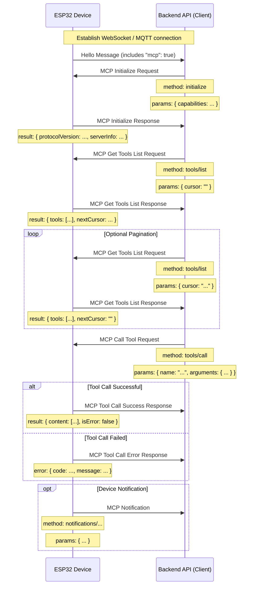

# MCP (Model Context Protocol) Interaction Flow

NOTICE: AI-assisted generation. When implementing backend services, verify details against code!

This project uses MCP for communication between the backend API (MCP client) and the ESP32 device (MCP server), so the backend can discover and call device-side "tools".

## Protocol Format

Based on `main/protocols/protocol.cc` and `main/mcp_server.cc`, MCP messages are encapsulated inside the base communication protocol (WebSocket or MQTT). The internal structure follows [JSON-RPC 2.0](https://www.jsonrpc.org/specification).

Overall message structure:

```json
{
  "session_id": "...",  // Session ID
  "type": "mcp",        // Fixed message type
  "payload": {          // JSON-RPC 2.0 payload
    "jsonrpc": "2.0",
    "method": "...",    // Method name (e.g., "initialize", "tools/list", "tools/call")
    "params": { ... },  // Method parameters (for requests)
    "id": ...,          // Request ID (for requests and responses)
    "result": { ... },  // Execution result (for success responses)
    "error": { ... }    // Error info (for error responses)
  }
}
```

The `payload` is standard JSON-RPC 2.0:

- `jsonrpc`: fixed string `"2.0"`
- `method`: method name to call (in requests)
- `params`: method arguments, typically an object (in requests)
- `id`: request identifier; client provides it, server echoes it back to match request/response pairs
- `result`: result on success
- `error`: error info on failure

## Interaction Flow

### 1. Connection and Capability Announcement

- **When**: device starts and successfully connects to backend
- **Sender**: device
- **Message**: device sends the base protocol "hello" message, advertising supported capabilities (e.g., `"mcp": true`)

```json
{
  "type": "hello",
  "version": ...,
  "features": {
    "mcp": true
  },
  "transport": "websocket",
  "audio_params": { ... }
}
```

### 2. Initialize MCP Session

- **When**: backend receives device "hello" and confirms MCP support; typically the first MCP request
- **Sender**: backend (client)
- **Method**: `initialize`

Request payload:
```json
{
  "jsonrpc": "2.0",
  "method": "initialize",
  "params": {
    "capabilities": {
      // Optional client capabilities

      // Vision/camera related
      "vision": {
        "url": "...",    // Image processing URL (must be HTTP, not WebSocket)
        "token": "..."   // URL auth token
      }
    }
  },
  "id": 1
}
```

Device response:
```json
{
  "jsonrpc": "2.0",
  "id": 1,
  "result": {
    "protocolVersion": "2024-11-05",
    "capabilities": {
      "tools": {}
    },
    "serverInfo": {
      "name": "...",    // Device name (BOARD_NAME)
      "version": "..."  // Firmware version
    }
  }
}
```

### 3. Discover Device Tool List

- **When**: backend needs to know what tools (capabilities) the device supports
- **Sender**: backend (client)
- **Method**: `tools/list`

Request:
```json
{
  "jsonrpc": "2.0",
  "method": "tools/list",
  "params": {
    "cursor": ""   // Pagination cursor; empty string on first request
  },
  "id": 2
}
```

Device response:
```json
{
  "jsonrpc": "2.0",
  "id": 2,
  "result": {
    "tools": [
      {
        "name": "self.get_device_status",
        "description": "...",
        "inputSchema": { ... }
      },
      {
        "name": "self.audio_speaker.set_volume",
        "description": "...",
        "inputSchema": { ... }
      }
    ],
    "nextCursor": "..."  // Non-empty if more pages exist
  }
}
```

**Pagination**: if `nextCursor` is non-empty, send another `tools/list` request with that cursor value.

### 4. Call a Device Tool

- **When**: backend needs to execute a specific device function
- **Sender**: backend (client)
- **Method**: `tools/call`

Request:
```json
{
  "jsonrpc": "2.0",
  "method": "tools/call",
  "params": {
    "name": "self.audio_speaker.set_volume",
    "arguments": {
      "volume": 50
    }
  },
  "id": 3
}
```

Success response:
```json
{
  "jsonrpc": "2.0",
  "id": 3,
  "result": {
    "content": [
      { "type": "text", "text": "true" }
    ],
    "isError": false
  }
}
```

Error response:
```json
{
  "jsonrpc": "2.0",
  "id": 3,
  "error": {
    "code": -32601,
    "message": "Unknown tool: self.non_existent_tool"
  }
}
```

### 5. Device Notifications (Device-Initiated)

- **When**: device needs to notify the backend of an internal event (e.g., state change)
- **Sender**: device (server)
- **Format**: JSON-RPC notification — no `id` field

```json
{
  "jsonrpc": "2.0",
  "method": "notifications/state_changed",
  "params": {
    "newState": "idle",
    "oldState": "connecting"
  }
}
```

Backend receives the notification and acts accordingly without replying.

## Interaction Diagram



For specific parameter details and available tools, refer to `McpServer::AddCommonTools` in `main/mcp_server.cc` and individual tool implementations.
