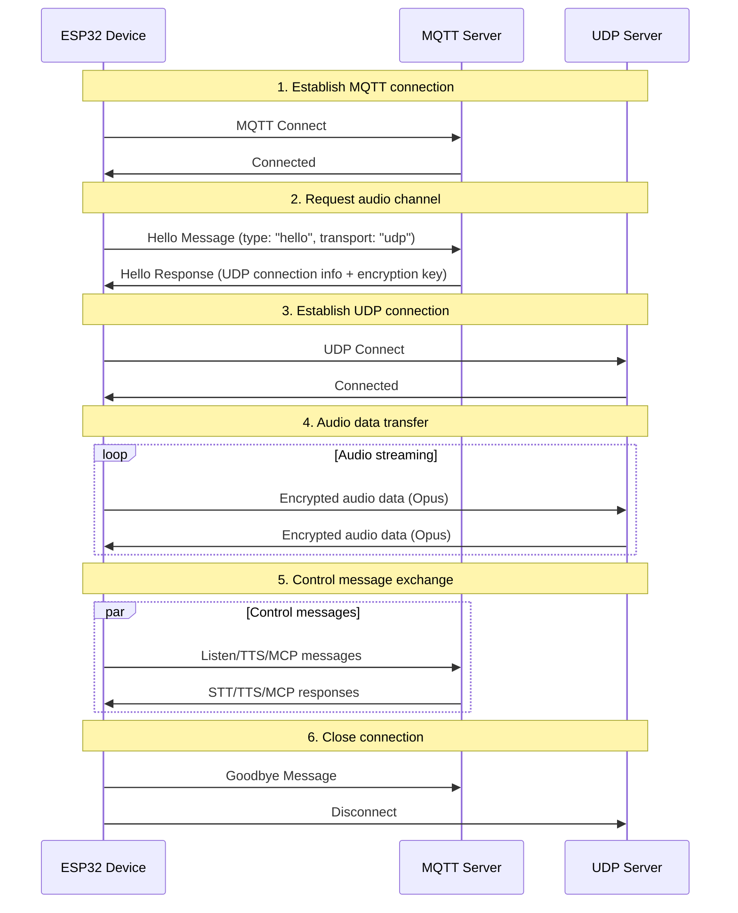
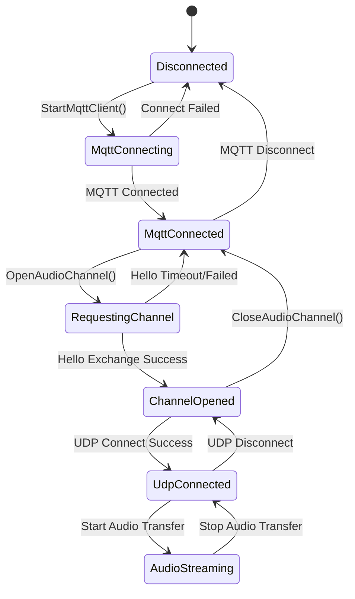

# MQTT + UDP Hybrid Communication Protocol

This document describes the MQTT + UDP hybrid protocol based on code analysis: how the device exchanges control messages over MQTT and audio data over UDP.

---

## 1. Protocol Overview

This protocol uses a dual-transport design:
- **MQTT**: control messages, state sync, JSON data exchange
- **UDP**: real-time audio data transmission with encryption

### 1.1 Key Characteristics

- **Dual-channel design**: control and data channels are separated for real-time performance
- **Encrypted transport**: UDP audio data is AES-CTR encrypted
- **Sequence number protection**: prevents packet replay and reordering
- **Auto-reconnect**: MQTT reconnects automatically on disconnect

---

## 2. Overall Flow



---

## 3. MQTT Control Channel

### 3.1 Connection Setup

Device connects to MQTT server with:
- **Endpoint**: MQTT server address and port
- **Client ID**: device unique identifier
- **Username/Password**: authentication credentials
- **Keep Alive**: heartbeat interval (default 240 seconds)

### 3.2 Hello Message Exchange

#### 3.2.1 Device sends Hello

```json
{
  "type": "hello",
  "version": 3,
  "transport": "udp",
  "features": {
    "mcp": true
  },
  "audio_params": {
    "format": "opus",
    "sample_rate": 16000,
    "channels": 1,
    "frame_duration": 60
  }
}
```

#### 3.2.2 Server responds Hello

```json
{
  "type": "hello",
  "transport": "udp",
  "session_id": "xxx",
  "audio_params": {
    "format": "opus",
    "sample_rate": 24000,
    "channels": 1,
    "frame_duration": 60
  },
  "udp": {
    "server": "192.168.1.100",
    "port": 8888,
    "key": "0123456789ABCDEF0123456789ABCDEF",
    "nonce": "0123456789ABCDEF0123456789ABCDEF"
  }
}
```

**Field descriptions:**
- `udp.server`: UDP server address
- `udp.port`: UDP server port
- `udp.key`: AES encryption key (hex string)
- `udp.nonce`: AES nonce (hex string)

### 3.3 JSON Message Types

#### 3.3.1 Device → Server

1. **Listen**
   ```json
   {
     "session_id": "xxx",
     "type": "listen",
     "state": "start",
     "mode": "manual"
   }
   ```

2. **Abort**
   ```json
   {
     "session_id": "xxx",
     "type": "abort",
     "reason": "wake_word_detected"
   }
   ```

3. **MCP**
   ```json
   {
     "session_id": "xxx",
     "type": "mcp",
     "payload": {
       "jsonrpc": "2.0",
       "id": 1,
       "result": {...}
     }
   }
   ```

4. **Goodbye**
   ```json
   {
     "session_id": "xxx",
     "type": "goodbye"
   }
   ```

#### 3.3.2 Server → Device

Supported message types match the WebSocket protocol:
- **STT**: speech recognition result
- **TTS**: speech synthesis control
- **LLM**: emotion expression control
- **MCP**: IoT control
- **System**: system control
- **Custom**: custom messages (optional)

---

## 4. UDP Audio Channel

### 4.1 Connection Setup

After receiving the MQTT Hello response, device:
1. Parses UDP server address and port
2. Parses encryption key and nonce
3. Initializes AES-CTR encryption context
4. Establishes UDP connection

### 4.2 Audio Data Format

#### 4.2.1 Encrypted audio packet structure

```
|type 1byte|flags 1byte|payload_len 2bytes|ssrc 4bytes|timestamp 4bytes|sequence 4bytes|
|payload payload_len bytes|
```

**Fields:**
- `type`: packet type, fixed `0x01`
- `flags`: flag bits, currently unused
- `payload_len`: payload length (network byte order)
- `ssrc`: synchronization source identifier
- `timestamp`: timestamp (network byte order)
- `sequence`: sequence number (network byte order)
- `payload`: encrypted Opus audio data

#### 4.2.2 Encryption

Uses **AES-CTR** mode:
- **Key**: 128-bit, provided by server
- **Nonce**: 128-bit, provided by server
- **Counter**: incorporates timestamp and sequence number

### 4.3 Sequence Number Management

- **Sender**: `local_sequence_` monotonically increases
- **Receiver**: `remote_sequence_` verifies continuity
- **Anti-replay**: rejects packets with sequence number below expected
- **Fault tolerance**: allows minor sequence gaps; logs warnings

### 4.4 Error Handling

1. **Decryption failure**: log error, discard packet
2. **Sequence number anomaly**: log warning, still process packet
3. **Malformed packet**: log error, discard packet

---

## 5. State Management

### 5.1 Connection States



### 5.2 Channel Availability Check

```cpp
bool IsAudioChannelOpened() const {
    return udp_ != nullptr && !error_occurred_ && !IsTimeout();
}
```

---

## 6. Configuration Parameters

### 6.1 MQTT Config

Read from settings:
- `endpoint`: MQTT server address
- `client_id`: client identifier
- `username`: username
- `password`: password
- `keepalive`: heartbeat interval (default 240 s)
- `publish_topic`: publish topic

### 6.2 Audio Parameters

- **Format**: Opus
- **Sample rate**: 16000 Hz (device) / 24000 Hz (server)
- **Channels**: 1 (mono)
- **Frame duration**: 60 ms

---

## 7. Error Handling and Reconnection

### 7.1 MQTT Reconnect

- Auto-retry on connection failure
- Error reporting control supported
- Cleanup triggered on disconnect

### 7.2 UDP Connection Management

- No auto-retry on failure
- Relies on MQTT channel to renegotiate
- Connection state queryable

### 7.3 Timeout Handling

Base class `Protocol` provides timeout detection:
- Default timeout: 120 seconds
- Calculated from last-received time
- Marked unavailable on timeout

---

## 8. Security

### 8.1 Transport Encryption

- **MQTT**: TLS/SSL (port 8883)
- **UDP**: AES-CTR encrypts audio data

### 8.2 Authentication

- **MQTT**: username/password authentication
- **UDP**: keys distributed via MQTT channel

### 8.3 Anti-Replay

- Monotonically increasing sequence numbers
- Rejects stale packets
- Timestamp verification

---

## 9. Performance

### 9.1 Concurrency Control

Mutex protects UDP connection:
```cpp
std::lock_guard<std::mutex> lock(channel_mutex_);
```

### 9.2 Memory Management

- Network objects dynamically created/destroyed
- Smart pointers manage audio packets
- Encryption contexts released promptly

### 9.3 Network Optimization

- UDP connection reuse
- Packet size optimization
- Sequence number continuity checks

---

## 10. Comparison: MQTT+UDP vs WebSocket

| Feature | MQTT + UDP | WebSocket |
|---------|------------|-----------|
| Control channel | MQTT | WebSocket |
| Audio channel | UDP (encrypted) | WebSocket (binary) |
| Latency | Low (UDP) | Moderate |
| Reliability | Moderate | High |
| Complexity | High | Low |
| Encryption | AES-CTR | TLS |
| Firewall-friendly | Low | High |

---

## 11. Deployment Recommendations

### 11.1 Network Environment

- Ensure UDP port is reachable
- Configure firewall rules
- Consider NAT traversal

### 11.2 Server Configuration

- MQTT Broker setup
- UDP server deployment
- Key management system

### 11.3 Monitoring Metrics

- Connection success rate
- Audio transmission latency
- Packet loss rate
- Decryption failure rate

---

## 12. Summary

The MQTT + UDP hybrid protocol achieves efficient voice communication through:

- **Separated architecture**: control and data channels each optimized independently
- **Encrypted protection**: AES-CTR ensures audio data security
- **Sequence management**: prevents replay attacks and packet reordering
- **Auto-recovery**: MQTT auto-reconnect after disconnect
- **Performance optimization**: UDP ensures real-time audio delivery

This protocol suits latency-sensitive voice interaction scenarios, but involves higher network complexity compared to WebSocket.
