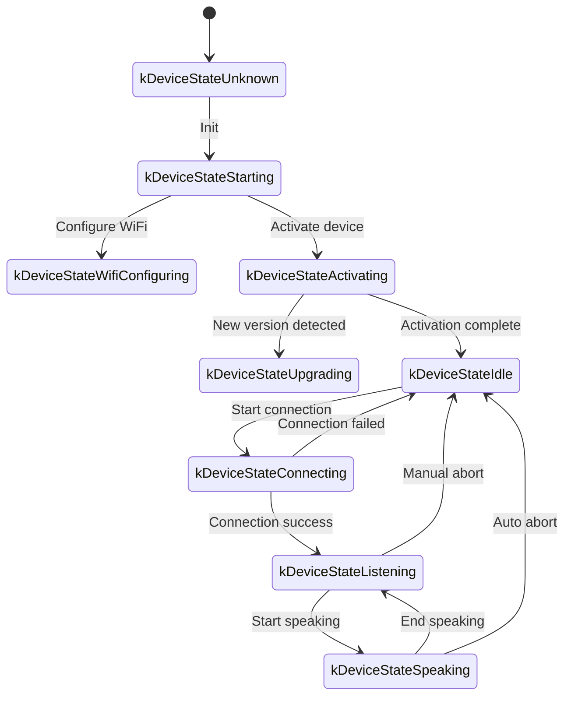
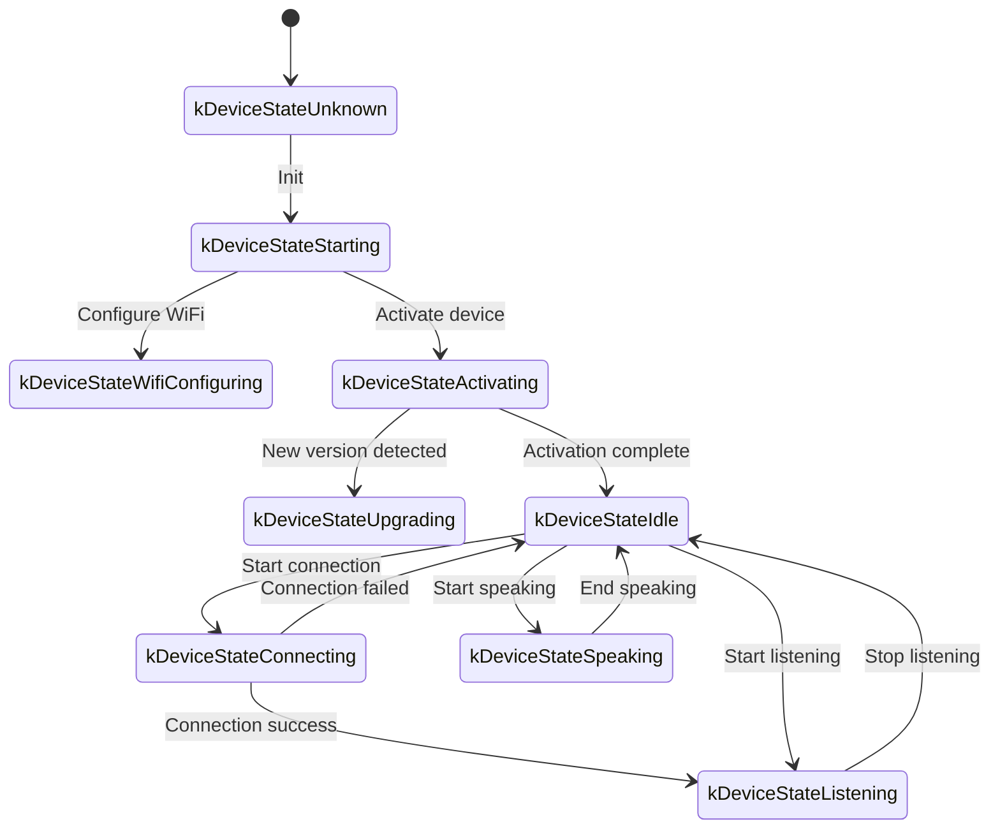

# WebSocket Communication Protocol

This document describes the WebSocket communication protocol between the device and the server, based on code analysis. Details may need to be verified against the server-side implementation.

---

## 1. Overall Flow

1. **Device initialization**
   - Device powers on and initializes `Application`:
     - Initializes audio codec, display, LEDs, etc.
     - Connects to network
     - Creates and initializes a `WebsocketProtocol` instance (implements the `Protocol` interface)
   - Enters main event loop (audio input, audio output, scheduled tasks, etc.)

2. **Establish WebSocket connection**
   - When a voice session needs to start (wake word, button press, etc.), `OpenAudioChannel()` is called:
     - Reads WebSocket URL from config
     - Sets request headers: `Authorization`, `Protocol-Version`, `Device-Id`, `Client-Id`
     - Calls `Connect()` to establish the WebSocket connection

3. **Device sends "hello"**
   - After connecting, the device sends:
   ```json
   {
     "type": "hello",
     "version": 1,
     "features": {
       "mcp": true
     },
     "transport": "websocket",
     "audio_params": {
       "format": "opus",
       "sample_rate": 16000,
       "channels": 1,
       "frame_duration": 60
     }
   }
   ```
   - `features` is optional; content is auto-generated from build config (e.g., `"mcp": true` means MCP protocol is supported)
   - `frame_duration` corresponds to `OPUS_FRAME_DURATION_MS` (e.g., 60 ms)

4. **Server replies "hello"**
   - Device waits for a JSON message with `"type": "hello"` and checks for `"transport": "websocket"`.
   - Server may include `session_id`; device records it automatically.
   - Example:
   ```json
   {
     "type": "hello",
     "transport": "websocket",
     "session_id": "xxx",
     "audio_params": {
       "format": "opus",
       "sample_rate": 24000,
       "channels": 1,
       "frame_duration": 60
     }
   }
   ```
   - On match: audio channel is marked open.
   - On timeout (default 10 seconds): connection fails and a network error callback fires.

5. **Subsequent message exchange**
   - Two main data types are exchanged:
     1. **Binary audio data** (Opus encoded)
     2. **Text JSON messages** (chat state, TTS/STT events, MCP protocol messages, etc.)

   - Receive callback behavior:
     - `OnData(...)`:
       - `binary == true` → treat as Opus audio frame; decode and play
       - `binary == false` → treat as JSON text; parse with cJSON and handle business logic

   - On disconnect, `OnDisconnected()` fires:
     - Device calls `on_audio_channel_closed_()` and returns to Idle state

6. **Close WebSocket connection**
   - Device calls `CloseAudioChannel()` to end a session, disconnects, and returns to Idle.
   - If the server disconnects first, the same callback flow is triggered.

---

## 2. Common Request Headers

Set during WebSocket handshake:

- `Authorization`: access token in the form `"Bearer <token>"`
- `Protocol-Version`: protocol version number; matches the `version` field in the hello message body
- `Device-Id`: device MAC address (physical NIC)
- `Client-Id`: software-generated UUID (reset on NVS erase or full reflash)

---

## 3. Binary Protocol Versions

The device supports multiple binary protocol versions, specified by the `version` field in config.

### 3.1 Version 1 (default)
Sends raw Opus audio data with no extra metadata. WebSocket text vs. binary frames distinguish message types.

### 3.2 Version 2
Uses the `BinaryProtocol2` struct:
```c
struct BinaryProtocol2 {
    uint16_t version;        // Protocol version
    uint16_t type;           // Message type (0: OPUS, 1: JSON)
    uint32_t reserved;       // Reserved
    uint32_t timestamp;      // Timestamp (ms, used for server-side AEC)
    uint32_t payload_size;   // Payload size in bytes
    uint8_t payload[];       // Payload data
} __attribute__((packed));
```

### 3.3 Version 3
Uses the `BinaryProtocol3` struct:
```c
struct BinaryProtocol3 {
    uint8_t type;            // Message type
    uint8_t reserved;        // Reserved
    uint16_t payload_size;   // Payload size
    uint8_t payload[];       // Payload data
} __attribute__((packed));
```

---

## 4. JSON Message Structure

WebSocket text frames carry JSON. Below are the common `"type"` values and their business logic.

### 4.1 Device → Server

1. **Hello**
   - Sent by device after connection; communicates basic parameters.
   ```json
   {
     "type": "hello",
     "version": 1,
     "features": { "mcp": true },
     "transport": "websocket",
     "audio_params": {
       "format": "opus",
       "sample_rate": 16000,
       "channels": 1,
       "frame_duration": 60
     }
   }
   ```

2. **Listen**
   - Device starts or stops recording.
   - Fields:
     - `"session_id"`: session identifier
     - `"type": "listen"`
     - `"state"`: `"start"`, `"stop"`, or `"detect"` (wake word triggered)
     - `"mode"`: `"auto"`, `"manual"`, or `"realtime"`
   ```json
   {
     "session_id": "xxx",
     "type": "listen",
     "state": "start",
     "mode": "manual"
   }
   ```

3. **Abort**
   - Terminates current TTS playback or voice session.
   ```json
   {
     "session_id": "xxx",
     "type": "abort",
     "reason": "wake_word_detected"
   }
   ```
   - `reason` can be `"wake_word_detected"` or other values.

4. **Wake Word Detected**
   - Informs server that a wake word was detected. Opus audio of the wake word may be sent beforehand for voiceprint verification.
   ```json
   {
     "session_id": "xxx",
     "type": "listen",
     "state": "detect",
     "text": "hello xiaozhi"
   }
   ```

5. **MCP**
   - Recommended IoT control protocol. All device capability discovery and tool calls use `type: "mcp"` messages; the payload is standard JSON-RPC 2.0 (see [MCP Protocol](./mcp-protocol.md)).
   ```json
   {
     "session_id": "xxx",
     "type": "mcp",
     "payload": {
       "jsonrpc": "2.0",
       "id": 1,
       "result": {
         "content": [{ "type": "text", "text": "true" }],
         "isError": false
       }
     }
   }
   ```

---

### 4.2 Server → Device

1. **Hello**
   - Handshake confirmation from server.
   - Must include `"type": "hello"` and `"transport": "websocket"`.
   - May include `audio_params` with server's expected audio config.
   - May include `session_id` which device records automatically.

2. **STT**
   ```json
   {"session_id": "xxx", "type": "stt", "text": "..."}
   ```
   - Server's speech-to-text result. Device may display this text.

3. **LLM**
   ```json
   {"session_id": "xxx", "type": "llm", "emotion": "happy", "text": "😀"}
   ```
   - Server instructs device to update emotion animation / UI.

4. **TTS**
   - `{"session_id": "xxx", "type": "tts", "state": "start"}` — Server is about to send TTS audio; device enters "speaking" state.
   - `{"session_id": "xxx", "type": "tts", "state": "stop"}` — TTS ended.
   - `{"session_id": "xxx", "type": "tts", "state": "sentence_start", "text": "..."}` — Display current TTS sentence to user.

5. **MCP**
   - Server sends IoT control commands or results via `type: "mcp"`. Payload structure matches device-to-server format.
   ```json
   {
     "session_id": "xxx",
     "type": "mcp",
     "payload": {
       "jsonrpc": "2.0",
       "method": "tools/call",
       "params": {
         "name": "self.light.set_rgb",
         "arguments": { "r": 255, "g": 0, "b": 0 }
       },
       "id": 1
     }
   }
   ```

6. **System**
   - System control commands, commonly used for OTA.
   ```json
   {
     "session_id": "xxx",
     "type": "system",
     "command": "reboot"
   }
   ```
   - Supported commands:
     - `"reboot"`: reboot the device

7. **Custom** (optional)
   - Custom messages when `CONFIG_RECEIVE_CUSTOM_MESSAGE` is enabled.
   ```json
   {
     "session_id": "xxx",
     "type": "custom",
     "payload": { "message": "custom content" }
   }
   ```

8. **Binary audio frames**
   - When server sends binary Opus frames, device decodes and plays them.
   - Frames received during "listening" state are discarded to prevent conflicts.

---

## 5. Audio Encoding

1. **Device → Server (recording)**
   - Mic input is optionally processed (echo cancellation, noise reduction, gain), then Opus-encoded into binary frames.
   - Depending on protocol version: raw Opus (v1) or framed binary with metadata (v2/v3).

2. **Server → Device (playback)**
   - Binary frames from server are treated as Opus data, decoded, then sent to audio output.
   - If server sample rate differs from device, resampling is applied after decode.

---

## 6. State Transitions

### Auto mode



### Manual mode



---

## 7. Error Handling

1. **Connection failure**
   - If `Connect(url)` fails or server hello times out, `on_network_error_()` fires. Device displays "Cannot connect to service" or similar.

2. **Server disconnects**
   - WebSocket disconnect fires `OnDisconnected()`:
     - Device calls `on_audio_channel_closed_()`
     - Switches to Idle or retry logic

---

## 8. Additional Notes

1. **Authentication**
   - Device sends `Authorization: Bearer <token>`. Server must validate.
   - If token is expired or invalid, server may reject the handshake or disconnect later.

2. **Session control**
   - `session_id` in messages lets server distinguish independent conversations.

3. **Audio payload**
   - Default: Opus format, `sample_rate=16000`, mono. Frame duration controlled by `OPUS_FRAME_DURATION_MS` (typically 60 ms).
   - Server downlink audio may use 24000 Hz for better music playback quality.

4. **Binary protocol version config**
   - Version 1: raw Opus data
   - Version 2: includes timestamp for server-side AEC
   - Version 3: simplified binary protocol

5. **IoT control: use MCP**
   - All IoT capability discovery, state sync, and control should use MCP protocol (`type: "mcp"`).
   - The old `type: "iot"` scheme is deprecated.

6. **Malformed JSON**
   - Missing required fields (e.g., `type`) cause a logged error; no business logic executes.

---

## 9. Message Sequence Example

1. **Device → Server** (handshake)
   ```json
   {
     "type": "hello",
     "version": 1,
     "features": { "mcp": true },
     "transport": "websocket",
     "audio_params": { "format": "opus", "sample_rate": 16000, "channels": 1, "frame_duration": 60 }
   }
   ```

2. **Server → Device** (handshake ack)
   ```json
   {
     "type": "hello",
     "transport": "websocket",
     "session_id": "xxx",
     "audio_params": { "format": "opus", "sample_rate": 16000 }
   }
   ```

3. **Device → Server** (start listening)
   ```json
   { "session_id": "xxx", "type": "listen", "state": "start", "mode": "auto" }
   ```
   Device also begins sending binary Opus frames.

4. **Server → Device** (ASR result)
   ```json
   { "session_id": "xxx", "type": "stt", "text": "what the user said" }
   ```

5. **Server → Device** (TTS start)
   ```json
   { "session_id": "xxx", "type": "tts", "state": "start" }
   ```
   Server sends binary audio frames for playback.

6. **Server → Device** (TTS stop)
   ```json
   { "session_id": "xxx", "type": "tts", "state": "stop" }
   ```
   Device stops audio playback. If no further commands, returns to Idle.

---

## 10. Summary

The protocol uses WebSocket to transport JSON text frames and binary Opus audio frames, supporting: audio stream upload, TTS playback, speech recognition, state management, and MCP command dispatch.

Key characteristics:
- **Handshake**: device sends `"type":"hello"`, waits for server reply
- **Audio channel**: bidirectional binary Opus frames; multiple protocol versions supported
- **JSON messages**: `"type"` field identifies business logic (TTS, STT, MCP, WakeWord, System, Custom, etc.)
- **Extensibility**: JSON messages can have additional fields; extra auth can go in headers

Server and device must agree on field semantics, timing logic, and error handling for smooth communication.
